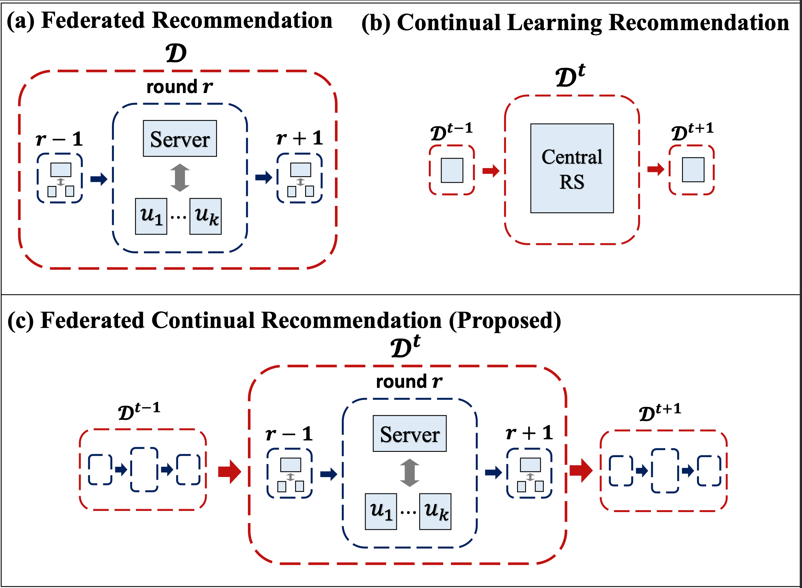
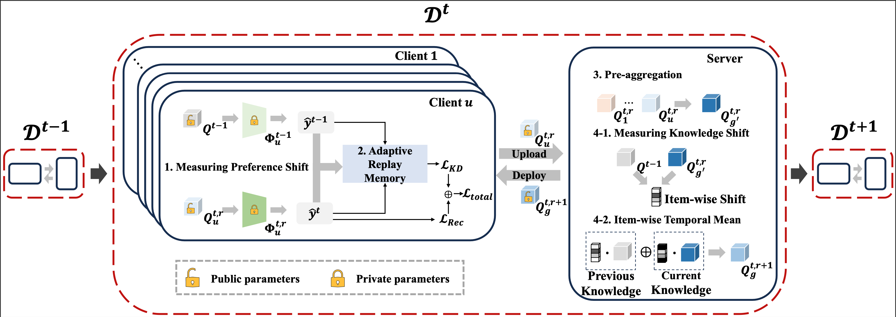

# Federated Continual Recommendation

Official PyTorch implementation of our CIKM 2025 paper.

Our paper is now available on: https://arxiv.org/pdf/2508.04792

## 1. Overview

This repository contains the official implementation of our paper **"Federated Continual Recommendation"**, accepted as a full research paper at CIKM 2025.

In this work, we propose a novel research task: **Federated Continual Recommendation**, which jointly considers two orthogonal challenges — *federated recommendation* and *continual recommendation* — in a unified framework.  
We carefully consider the unique constraints of each task and design our solution accordingly.

<p align="center">
  
</p>

Conventional continual recommendation models and federated recommendation models are fundamentally incompatible due to conflicting assumptions.  
To address this challenge, we propose two continual learning strategies tailored for the federated setting:

1. **Client-side continual learning**: Adaptive Replay Memory  
2. **Server-side continual learning**: Item-wise Temporal Mean

<p align="center">
  
</p>

---

## 2. Source Code & Usage

We provide fine-tuned FedMF weights for the base block ($\mathcal{D}^0$) on the **MovieLens-100K** dataset.

### Environment Setup
```
conda env create -f enviroment.yml
```

- fine-tuning base block
```
python main.py --save_model 1 --load_model 0 --backbone fedmf --model fcrec --lr 1.0 --dim 32 --patience 30 --client_cl --server_cl --reg_client_cl 0.1 --eps 0.006 --topN 30 --beta 0.9 --num_round 100 --dataset ml-100k
```

- training incremental block
```
python3 main.py --load_model 1 --backbone fedmf --model fcrec --lr 1.0 --dim 32 --patience 30 --client_cl --server_cl --reg_client_cl 0.1 --eps 0.006 --topN 30 --beta 0.9 --num_round 100 --dataset ml-100k
```
